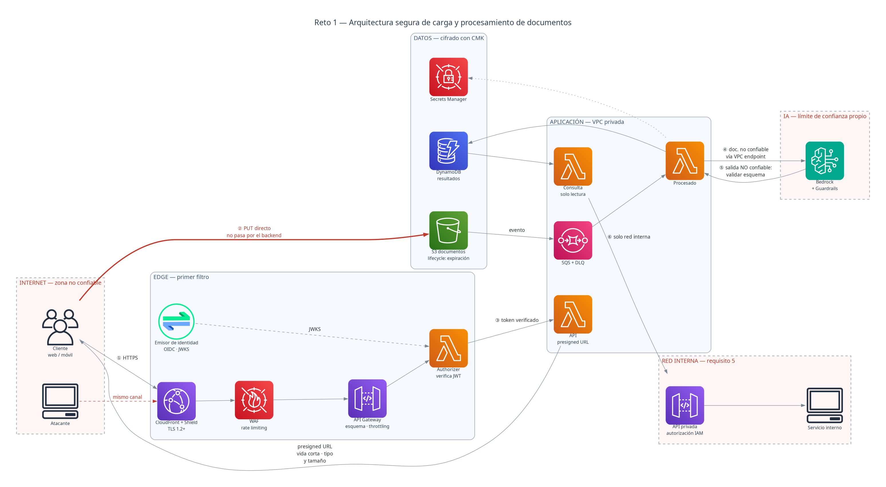
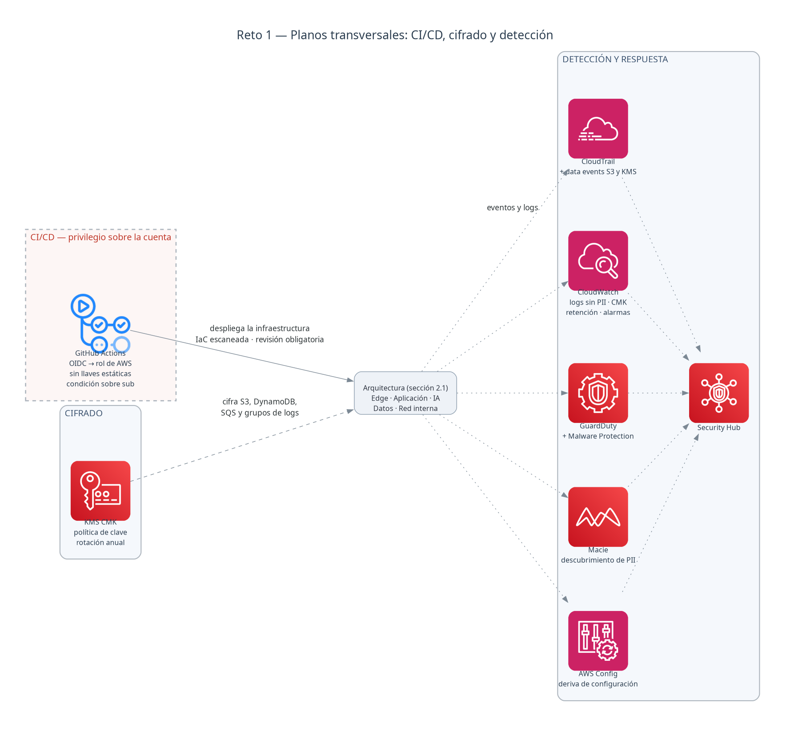

# Reto 1 — Arquitectura Cloud segura para carga y procesamiento de documentos

Revisión de seguridad de la iniciativa **antes** de que comience el desarrollo.

| Entregable | Documento |
| --- | --- |
| 1. Diagrama de arquitectura con controles | Este documento |
| 2. Threat Model (STRIDE, priorizado por riesgo) | [`threat-model.md`](./threat-model.md) |
| 3. Riesgos de seguridad asociados a IA | [`ai-security-risks.md`](./ai-security-risks.md) |

---

## 1. Contexto y decisiones de partida

La propuesta inicial es `App móvil/web → API → Backend → almacenamiento → procesamiento IA → base de datos`, expuesta a Internet, con documentos que contienen información sensible y resultados que pueden contener PII.

Tres decisiones condicionan todo el diseño:

1. **El documento no atraviesa el backend.** La subida va directa a S3 mediante *presigned URL*. Un binario no confiable de tamaño arbitrario que pasa por API Gateway y Lambda es coste, latencia y superficie de ataque sin contrapartida.
2. **El procesamiento vive en subredes privadas sin salida a Internet.** Todo el tráfico hacia S3, DynamoDB, Bedrock, KMS y Secrets Manager va por *VPC endpoints*. Si una Lambda se ve comprometida, no tiene ruta hacia el exterior por la que exfiltrar.
3. **El consumidor interno no comparte puerta con Internet.** El requisito 5 (un servicio interno consulta los resultados) se resuelve con una API privada, no añadiendo un endpoint más a la API pública.

### Servicios añadidos a la propuesta original

| Servicio | Por qué |
| --- | --- |
| AWS WAF | El sistema está expuesto a Internet y acepta subidas. Sin WAF no hay filtrado de patrones de ataque ni *rate limiting* por IP antes de la lógica de negocio. |
| Amazon SQS | Desacopla la subida del procesamiento. Absorbe picos, permite reintentos controlados y una DLQ para documentos que fallan, en lugar de perderlos en silencio. |
| Amazon Macie | Requisito 4: los resultados *pueden* contener PII. Macie convierte ese "pueden" en un hecho verificable y descubre PII residual en S3. |
| GuardDuty (con S3 Malware Protection) | Detección de comportamiento anómalo y análisis antimalware de los objetos subidos antes de procesarlos. |
| AWS Config + Security Hub | La infraestructura es IaC, pero la deriva ocurre igual. Detectan un bucket que deja de estar cifrado o un SG que se abre. |
| VPC + VPC endpoints | Ver decisión 2. Sin VPC, una Lambda comprometida tiene salida directa a Internet. |
| Emisor de identidad (OIDC) | El enunciado da el JWT por hecho pero no dice quién lo emite. Sin emisor definido no hay `iss` que validar, ni JWKS contra el que verificar la firma, ni rotación de claves. Se representa sin producto concreto: ver [§5](#5-qué-queda-pendiente-de-acordar). |

---

## 2. Diagrama de arquitectura

Los diagramas usan los iconos oficiales de AWS y se generan desde código: [`diagrams/architecture.py`](./diagrams/architecture.py). Se revisan en un *pull request* como cualquier otro cambio y no pueden quedar desincronizados sin que se vea en el diff. Para regenerarlos, ver [`diagrams/README.md`](./diagrams/README.md).

### 2.1 Flujo de datos y zonas de confianza

**Cómo leer el diagrama.** Cada recuadro es una zona con un nivel de confianza distinto; los de borde discontinuo rojo son límites de confianza. Las flechas que los cruzan van numeradas ①-⑥ con la misma numeración que el [DFD del threat model](./threat-model.md#diagrama-de-flujo-de-datos-y-límites-de-confianza), para poder leer ambos documentos cruzados. La flecha roja gruesa es el flujo del binario no confiable. El DFD tiene una frontera más, la ⑦ (CI/CD → cuenta AWS), que aquí no aparece porque el pipeline no participa del flujo en tiempo de ejecución: su plano es el de [§2.2](#22-planos-transversales).

Tres cosas que el diagrama afirma deliberadamente:

- **El atacante entra por el mismo canal que el cliente legítimo.** No hay una "puerta del atacante" separada que cerrar: por eso todo control de entrada se concentra en el edge.
- **La zona de IA es una frontera de confianza propia**, con Guardrails en ambos sentidos. Entra un documento no confiable (④) y sale una respuesta igual de no confiable (⑤), que hay que validar contra un esquema antes de persistirla.
- **El documento no pasa por el backend** (②) y **el consumidor interno no comparte puerta con Internet** (⑥).

### 2.2 Planos transversales

Cifrado, despliegue y detección atraviesan todas las zonas anteriores. Se representan aparte para no convertir el diagrama de flujo en una maraña de aristas.

La caja central, *Arquitectura de §2.1*, no es un servicio: representa el diagrama anterior completo, y es la costura entre ambos. Sin ella, cada plano transversal tendría que trazar una arista hacia cada nodo del otro diagrama. La zona **Internet** queda deliberadamente fuera —el cliente y el atacante no son infraestructura propia: no se despliegan, ni se cifran, ni los audita CloudTrail—; la **red interna** sí entra, porque la API privada y la Lambda de consulta se despliegan con el mismo pipeline y se auditan igual que el resto.

## 3. Controles, de fuera hacia dentro

### 3.1 Edge

| Control | Por qué |
| --- | --- |
| **CloudFront** con TLS 1.2+, HSTS y cabeceras de seguridad | Termina TLS en el borde y da un único punto donde aplicar política de transporte. Evita que cada origen la reimplemente. |
| **AWS Shield Standard** | Incluido con CloudFront. Absorbe DDoS de capas 3 y 4 antes de que consuman capacidad de la API. |
| **AWS WAF** con reglas gestionadas y *rate limiting* por IP | El sistema está expuesto a Internet. Filtra patrones conocidos y limita el volumen por origen antes de que la petición llegue a la lógica de negocio y genere coste. |
| **API Gateway: validación de esquema del request** | Rechaza cuerpos malformados en el borde. Reduce la superficie que la Lambda tiene que tratar defensivamente. |
| **API Gateway: throttling y cuotas de uso por cliente** | El límite por IP del WAF no basta cuando el atacante está autenticado. La cuota por cliente acota el DoS económico. |
| **Lambda Authorizer que verifica firma, `iss`, `aud` y `exp` del JWT** | El enunciado dice que *"la aplicación utiliza JWT para autenticación"*. Eso describe un formato de token, no un control. Un JWT sin verificación de firma —o que acepta `alg: none`— es un objeto que el atacante escribe entero. **Este es el control, no el JWT.** |
| **Autorización por recurso, además de autenticación** | Un token válido dice *quién eres*, no *a qué tienes derecho*. La comprobación de propiedad del documento va en la lógica, y su ausencia es la amenaza de mayor riesgo del modelo (BOLA). |
| **Emisor de identidad explícito, con JWKS publicado y rotación de claves de firma** | El authorizer verifica; **el emisor es quien firma**. Sin él como pieza del diseño, el control de la fila anterior no tiene contra qué verificar. Lo innegociable no depende del producto: JWKS publicado y cacheado con TTL corto, lista blanca de algoritmos, `iss`/`aud`/`exp`/`nbf`, tokens de vida corta con *refresh* y rotación de las claves de firma. |

### 3.1.1 Cliente móvil

El enunciado habla de *"aplicación web y móvil"*. El binario de una app móvil está en manos del usuario y se puede descompilar, así que el cliente no es un lugar donde poner controles de seguridad — pero sí donde se custodia el token que abre todo lo anterior.

| Control | Por qué |
| --- | --- |
| **Token en Keychain (iOS) / Keystore (Android), nunca en `UserDefaults`, `SharedPreferences` ni ficheros planos** | El token es la credencial. En almacenamiento plano lo lee cualquier backup sin cifrar o cualquier app con acceso al sistema de ficheros en un dispositivo comprometido. Es el mismo Spoofing de la amenaza #2, por otra vía. |
| **Certificate pinning contra el certificado de CloudFront** | El TLS del edge no protege de un proxy con una CA instalada en el dispositivo. Sin pinning, el token y el documento son legibles en un dispositivo intervenido. |
| **Sin secretos embebidos en el binario** | Toda clave dentro de un `.ipa` o un `.apk` es pública: se extrae descompilando. Los secretos viven en Secrets Manager y solo el backend los ve. Verificable con escaneo del artefacto en el pipeline. |
| **Attestation del cliente (App Attest / Play Integrity) antes de emitir la presigned URL** | Acota que la URL de subida se emita a una instancia legítima de la app y no a un script. Es defensa en profundidad sobre el DoS económico (#7), no un sustituto de la cuota por cliente. |

### 3.2 Subida del documento

| Control | Por qué |
| --- | --- |
| **Presigned URL de S3 (PUT)** | El binario va directo a S3. El backend no manipula contenido no confiable ni paga su tránsito. |
| **Vencimiento corto (≈5 min), un solo uso lógico** | Una URL prefirmada es una credencial portadora: quien la tenga, escribe. Su vida útil es su ventana de abuso. |
| **`Content-Type` y `content-length-range` en la política de firma** | Sin restricción de tamaño, la URL es un canal de subida ilimitada a coste del propietario de la cuenta. Sin restricción de tipo, es un canal para cualquier binario. |
| **Bucket privado + Block Public Access a nivel de cuenta** | Elimina la clase de incidente más frecuente en S3: la exposición por configuración. A nivel de cuenta, para que no dependa de que cada bucket lo aplique. |
| **Bucket policy con `aws:SecureTransport: true`** | Deniega cualquier acceso que no sea TLS, incluido el que use credenciales válidas. |
| **SSE-KMS con CMK propia + versionado** | La CMK permite política de clave, auditoría de uso en CloudTrail y revocación independiente del bucket. El versionado protege frente a sobrescritura maliciosa. |
| **Análisis antimalware (GuardDuty Malware Protection for S3) antes de procesar** | El documento es contenido no confiable subido por un tercero. Se analiza antes de que ninguna Lambda lo abra. |
| **Validación del tipo real del fichero, no de la extensión** | El `Content-Type` lo declara el cliente. La validación real ocurre en el consumidor, sobre los bytes. |

### 3.3 Procesamiento

| Control | Por qué |
| --- | --- |
| **Lambda en subredes privadas, sin NAT ni IGW** | Sin ruta a Internet, una Lambda comprometida no tiene por dónde exfiltrar ni por dónde recibir instrucciones. |
| **VPC endpoints a S3, DynamoDB, Bedrock, KMS y Secrets Manager** | Consecuencia de lo anterior: el tráfico a los servicios AWS no sale a la red pública. Con políticas de endpoint que restringen a los recursos de esta solución. |
| **Un rol IAM por función, con mínimo privilegio y condiciones** | Tres funciones con tres necesidades distintas. Un rol compartido con `s3:*` convierte cualquier fallo en una de ellas en acceso total. Las condiciones (`aws:SourceVpce`, prefijo del objeto) acotan aún más. |
| **SQS entre la subida y el procesamiento, con DLQ** | Absorbe picos, permite reintentos acotados y aísla los documentos que fallan en lugar de reintentarlos indefinidamente a coste creciente. |
| **Bedrock Guardrails con filtro de PII y de contenido** | El documento entra al modelo como texto. Guardrails filtra en ambos sentidos: lo que entra y lo que sale. Detalle en [`ai-security-risks.md`](./ai-security-risks.md). |
| **Validación de la salida del modelo contra un esquema estricto antes de persistir** | Todo lo que sale del modelo cruza hacia zona no confiable. Ver LLM02/LLM09 en el documento de IA. |
| **Timeouts, límite de concurrencia reservada y presupuesto de invocación** | Acota el gasto ante una subida masiva y evita que el procesamiento agote la concurrencia de la cuenta. |

### 3.4 Datos

| Control | Por qué |
| --- | --- |
| **DynamoDB cifrada con CMK + PITR** | Los resultados pueden contener PII (requisito 4). La CMK da control y auditoría de la clave; PITR permite recuperación ante borrado o corrupción. |
| **Regla de ciclo de vida de S3 que expira el documento original** | **Requisito 3 del enunciado.** Es un control de seguridad, no de coste: reduce la ventana de exposición del documento sensible. Debe cubrir también versiones no actuales y subidas multiparte incompletas, o el objeto sigue ahí tras "borrarse". |
| **TTL en DynamoDB** | Aplica si los resultados tienen periodo de retención definido. Requiere acordar el plazo con negocio y con la base legal del tratamiento. |
| **Amazon Macie** | Verifica que la clasificación de PII asumida es la real y detecta PII residual donde no se esperaba. |
| **Cifrado de logs de CloudWatch con CMK + retención definida** | Los logs son un almacén de datos más, y el punto de fuga de PII más fácil de pasar por alto. |
| **Secrets Manager con rotación automática** | Ningún secreto en variables de entorno, en el repositorio ni en el código. |

### 3.5 Consumidor interno (requisito 5)

| Control | Por qué |
| --- | --- |
| **API Gateway privada, accesible solo por VPC endpoint** | El consumidor es interno: no hay razón para que su superficie esté en Internet. Reduce el problema a la red interna. |
| **Autorización IAM (SigV4) en lugar del JWT de cliente** | El servicio interno no es un cliente. Con IAM la identidad es del rol, es rotatoria y queda en CloudTrail. |
| **Lambda de solo lectura, con rol restringido a los atributos necesarios** | La consulta no necesita escribir ni leer registros completos si solo requiere un subconjunto. |
| **Filtrado de campos por consumidor** | Que el resultado contenga PII no implica que el consumidor interno la necesite toda. |

### 3.6 CI/CD y cadena de suministro

| Control | Por qué |
| --- | --- |
| **GitHub Actions con OIDC hacia un rol de AWS, sin llaves estáticas** | Una `AWS_SECRET_ACCESS_KEY` en los secretos del repositorio es una credencial de larga duración que no caduca y viaja en cada log mal configurado. OIDC la sustituye por credenciales temporales. |
| **Rol de despliegue restringido por `sub` del repositorio y la rama** | Sin la condición de `sub`, cualquier workflow del repositorio —incluido uno introducido en un fork o una rama— puede asumir el rol. |
| **Escaneo de IaC (Checkov / Trivy config) bloqueante en el pipeline** | La infraestructura se define en código: los fallos de configuración son detectables antes de existir. |
| **SAST y SCA (dependencias) en el pipeline** | Cubre el código propio y el heredado de terceros. |
| **Revisión obligatoria + protección de rama + entorno de despliegue con aprobación** | Ningún cambio de infraestructura llega a producción con un solo par de ojos. |
| **Secret scanning con *push protection*** | Detiene el secreto antes del commit, no después del incidente. |

### 3.7 Detección y respuesta

| Control | Por qué |
| --- | --- |
| **CloudTrail con *data events* de S3 y KMS** | Sin data events no queda registro de quién leyó qué objeto. En una investigación de fuga es exactamente la pregunta a responder. |
| **CloudWatch con alarmas** | Sobre señales que importan: picos de subida, errores del authorizer, mensajes en la DLQ, invocaciones de Bedrock por encima del umbral, denegaciones de acceso. |
| **GuardDuty** | Detección de comportamiento anómalo en la cuenta, en la red y en los objetos de S3. |
| **AWS Config** | Detecta la deriva respecto al estado definido en IaC, que ocurre incluso con IaC. |
| **Security Hub** | Agrega los hallazgos de todo lo anterior en un único punto, con marcos de referencia. |
| **Correlación por identificador de petición de extremo a extremo** | Un evento suelto no reconstruye un incidente. La traza tiene que poder seguirse desde el edge hasta DynamoDB. |

---

## 4. Cobertura de los requisitos del enunciado

| # | Requisito | Control asociado |
| --- | --- | --- |
| 1 | Se extrae información mediante IA | Bedrock tras VPC endpoint, con Guardrails en entrada y salida, modelo fijado por región y validación de la salida contra esquema (§3.3, [`ai-security-risks.md`](./ai-security-risks.md)) |
| 2 | El resultado se almacena en DynamoDB | Tabla cifrada con CMK, PITR, escritura solo desde el rol de la Lambda de procesado (§3.4) |
| 3 | El documento original debe eliminarse tras un periodo | Regla de ciclo de vida de S3 con expiración, incluyendo versiones no actuales y multiparte incompletas; verificación por Config (§3.4) |
| 4 | Los resultados pueden contener PII | Cifrado con CMK, Guardrails con filtro de PII, Macie, logs sin PII y filtrado de campos por consumidor (§3.3, §3.4, §3.5) |
| 5 | Un servicio interno consulta los resultados por API | API privada por VPC endpoint con autorización IAM y Lambda de solo lectura, separada de la superficie pública (§3.5) |
| — | El sistema está expuesto a Internet | CloudFront + Shield + WAF + validación de esquema + throttling + verificación real del JWT (§3.1) |
| — | La funcionalidad se usa desde aplicación web **y móvil** | El cliente no es donde se ponen los controles, pero sí donde se custodia el token: Keychain/Keystore, *certificate pinning*, sin secretos en el binario y *attestation* antes de emitir la presigned URL (§3.1.1) |
| — | Despliegue con IaC y GitHub Actions | OIDC sin llaves estáticas, rol restringido por `sub`, escaneo de IaC bloqueante, SAST/SCA y revisión obligatoria (§3.6) |

---

## 5. Qué queda pendiente de acordar

Un diseño honesto declara lo que no puede decidir por su cuenta:

- **Qué emite los JWT.** El enunciado dice que la aplicación *usa* JWT, no quién los firma. Si ya existe una plataforma de identidad corporativa, el diseño federa con ella; si no, Amazon Cognito es la opción de menor fricción. El diseño no depende de esa elección: solo asume que el emisor publica JWKS, rota sus claves de firma y emite `iss` y `aud` verificables.
- **El plazo de retención del documento original y de los resultados.** El enunciado dice "un periodo determinado" sin fijarlo. Es una decisión de negocio y de base legal, no técnica.
- **Multi-tenancy.** Si un mismo cliente corporativo agrupa a varios usuarios, hace falta un modelo de autorización jerárquico que aquí solo se cubre a nivel de propiedad del documento.
- **Residencia de los datos y región de Bedrock.** Determina qué modelos hay disponibles y qué marco regulatorio aplica al tratamiento.
- **Si el resultado se muestra a un cliente final.** Cambia la severidad de LLM02/LLM09: la salida del modelo pasaría a alcanzar un navegador.
- **Volumen esperado.** Condiciona los umbrales de throttling, la concurrencia reservada y si el DoS económico es una amenaza real o teórica.
