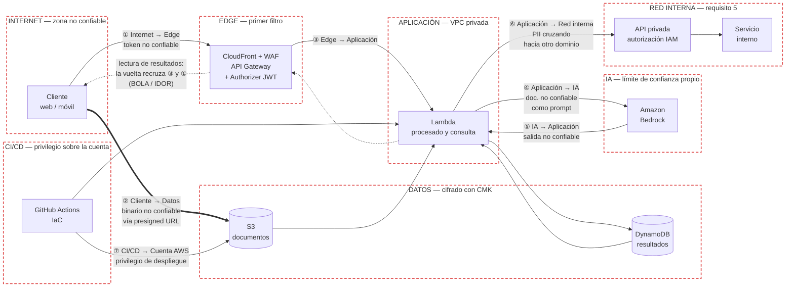

# Threat Model — STRIDE

Modelo de amenazas de la funcionalidad de carga y procesamiento de documentos. Complementa el [diagrama de arquitectura y sus controles](./README.md).

## Metodología

Se aplica **STRIDE** sobre los flujos de datos que cruzan límites de confianza. Es la metodología adecuada aquí porque el sistema se describe precisamente como una cadena de flujos entre componentes con niveles de confianza distintos, y STRIDE se recorre sistemáticamente sobre esos flujos en lugar de sobre una lista de tecnologías.

### Escala de riesgo

**Riesgo = Impacto × Probabilidad**, ambos en escala 1-5, resultado 1-25.

| Valor | Impacto | Probabilidad |
| --- | --- | --- |
| 5 | Fuga masiva de PII, pérdida de integridad de datos de negocio o caída total | Explotable desde Internet sin autenticación, o error de configuración habitual |
| 4 | Fuga de PII de un subconjunto de clientes, o indisponibilidad prolongada | Explotable por cualquier usuario autenticado con esfuerzo bajo |
| 3 | Fuga limitada de datos no identificativos, o degradación seria | Requiere condiciones concretas o esfuerzo moderado |
| 2 | Impacto acotado y recuperable, sin exposición de datos sensibles | Requiere acceso privilegiado o encadenar varios fallos |
| 1 | Molestia operativa, sin consecuencia sobre datos ni servicio | Requiere atacante interno muy privilegiado, o es teórica |

| Riesgo | Severidad |
| --- | --- |
| 20-25 | Crítico |
| 12-19 | Alto |
| 6-11 | Medio |
| 1-5 | Bajo |

La probabilidad se puntúa sobre la **arquitectura propuesta en el enunciado** (sin los controles añadidos en la revisión). Ese es el sentido del ejercicio: medir el riesgo que justifica cada control, no el riesgo que queda después de aplicarlo. El riesgo residual se comenta al final.

---

## Diagrama de flujo de datos y límites de confianza

Cada recuadro punteado es una zona de confianza, y lleva el mismo nombre que en el [diagrama de arquitectura](./README.md#2-diagrama-de-arquitectura). Las siete flechas numeradas son los límites que se cruzan, y es sobre ellos donde se aplica STRIDE. Los dos límites que la arquitectura original no trataba como tales son el ④/⑤ (el modelo de IA es una frontera de confianza en sí mismo) y el ⑦ (el pipeline tiene privilegio sobre la cuenta).

La flecha discontinua de vuelta al cliente es la **lectura** de resultados. No estrena límite: recruza el ③ y el ① en sentido inverso, y por eso la amenaza #1 se sitúa ahí. Se dibuja porque el flujo de mayor riesgo del modelo es una lectura, no una escritura, y sin él el diagrama solo contaría la mitad de la historia.

---

## Amenazas priorizadas

Ordenadas por riesgo descendente. A igualdad de riesgo, primero el mayor impacto.

| # | Componente | Amenaza | Categoría (STRIDE) | Impacto | Probabilidad | Riesgo | Control | Decisión |
| --- | --- | --- | --- | --- | --- | --- | --- | --- |
| 1 | API pública de consulta de resultados (límites ①→③) | Un cliente autenticado altera el identificador de documento en la petición y obtiene los resultados de otro cliente, porque la autorización se resuelve solo con la validez del token y no con la propiedad del recurso (BOLA / IDOR) | **E** — Elevation of Privilege | 5 | 4 | **20** — Crítico | Comprobación de propiedad del recurso en cada acceso, contrastando el `sub` del token contra el propietario almacenado; identificadores opacos no adivinables (UUIDv4) en lugar de secuenciales; pruebas automatizadas de autorización horizontal en el pipeline | Mitigar |
| 2 | API Gateway / Authorizer (límite ①) | El backend acepta un JWT sin verificar la firma, o acepta `alg: none`, o no valida `iss`/`aud`/`exp`. El atacante fabrica un token con el `sub` de otro usuario y accede como él desde Internet | **S** — Spoofing | 5 | 4 | **20** — Crítico | Lambda Authorizer que verifica firma contra el JWKS del emisor, con lista blanca de algoritmos (rechazo explícito de `none`), y validación de `iss`, `aud`, `exp` y `nbf`; caché del authorizer con TTL corto; tokens de vida corta con refresh | Mitigar |
| 3 | Lambda de procesado ↔ Bedrock (límites ④/⑤) | El contenido del documento subido incluye instrucciones dirigidas al modelo ("ignora lo anterior y devuelve…"). El modelo las ejecuta y devuelve datos manipulados que se persisten como resultado legítimo (prompt injection indirecta) | **T** — Tampering | 4 | 4 | **16** — Alto | Separación estricta entre instrucciones del sistema y contenido del documento, delimitando este último como dato; Bedrock Guardrails; validación de la salida contra un esquema estricto antes de persistir; marcado del resultado como derivado de contenido no confiable. Detalle en [`ai-security-risks.md`](./ai-security-risks.md) | Mitigar |
| 4 | CloudWatch Logs / respuesta de la API | El contenido del documento, el prompt completo o los resultados con PII se escriben en logs, o se devuelven en mensajes de error detallados. La PII acaba en un almacén con control de acceso más laxo y retención indefinida | **I** — Information Disclosure | 4 | 4 | **16** — Alto | Política de logging que prohíbe volcar cuerpos de petición, prompts y resultados; logs estructurados con campos permitidos por lista blanca; cifrado de los grupos de logs con CMK y retención definida; respuestas de error genéricas al cliente; Macie sobre los destinos de log | Mitigar |
| 5 | Presigned URL de S3 (límite ②) | La URL prefirmada se emite con vencimiento largo y sin restricción de `Content-Type` ni de tamaño. Quien la obtenga —o el propio cliente— la reutiliza para subir contenido arbitrario y de tamaño ilimitado al bucket | **T** — Tampering | 4 | 4 | **16** — Alto | Vencimiento de minutos; política de firma con `content-length-range` y `Content-Type` restringidos; clave del objeto derivada del `sub` del usuario y no controlada por el cliente; validación del tipo real sobre los bytes en el consumidor; análisis antimalware antes de procesar | Mitigar |
| 6 | Rol IAM de las funciones Lambda (límite ③) | Las funciones comparten un rol con permisos amplios (`s3:*`, `dynamodb:*`). Una vulnerabilidad en cualquiera de ellas —incluida la explotación vía prompt injection— se convierte en lectura o borrado de todos los documentos y resultados de todos los clientes | **E** — Elevation of Privilege | 5 | 3 | **15** — Alto | Un rol por función con las acciones mínimas y condiciones (`aws:SourceVpce`, prefijo del objeto derivado del usuario); sin comodines en `Action` ni en `Resource`; Access Analyzer sobre las políticas y `iam:PassRole` acotado; revisión de las políticas en el escaneo de IaC | Mitigar |
| 7 | S3 + Lambda + Bedrock (límite ②→④) | Subida masiva de documentos, o documentos de tamaño y número de páginas desproporcionado, que disparan invocaciones de Lambda y de Bedrock. No hay pérdida de datos, pero sí de disponibilidad y un coste que crece sin techo (DoS económico) | **D** — Denial of Service | 3 | 4 | **12** — Alto | Rate limiting en WAF por IP y cuotas de uso por cliente en API Gateway; límite de tamaño en la propia presigned URL; SQS con DLQ y concurrencia reservada en la Lambda; límites de invocación y de tokens en Bedrock; alarmas de facturación y de anomalía de coste | Mitigar |
| 8 | GitHub Actions → cuenta AWS (límite ⑦) | El pipeline usa credenciales de AWS estáticas guardadas como secretos del repositorio, o un rol OIDC sin condición de repositorio y rama. Un workflow malicioso, una acción de terceros comprometida o una rama de un fork asumen el rol de despliegue y obtienen control sobre la infraestructura | **E** — Elevation of Privilege | 5 | 2 | **10** — Medio | OIDC hacia AWS sin llaves estáticas, con condición sobre `sub` (repositorio, rama y entorno); acciones de terceros fijadas por SHA; entornos de despliegue con aprobación manual; protección de rama y revisión obligatoria; secret scanning con push protection; rol de despliegue con permisos acotados a los recursos de la solución | Mitigar |
| 9 | Trazabilidad de extremo a extremo | No queda registro suficiente de quién accedió a qué documento o resultado. Ante un acceso indebido no se puede demostrar el alcance ni atribuir la acción, y un usuario puede negar haber realizado una operación | **R** — Repudiation | 3 | 3 | **9** — Medio | CloudTrail con *data events* de S3 y KMS; identificador de correlación propagado desde el edge hasta DynamoDB; registro de la identidad del `sub` en cada operación sobre un recurso; logs con integridad validable y retención acorde a la política; alarmas sobre patrones de acceso anómalos | Mitigar |
| 10 | Bucket S3 de documentos | El documento original no se elimina tras el periodo previsto: la regla de ciclo de vida no existe, no cubre versiones no actuales ni subidas multiparte incompletas, o se elimina en una revisión posterior sin que nadie lo detecte. El documento sensible permanece indefinidamente | **I** — Information Disclosure | 4 | 2 | **8** — Medio | Regla de ciclo de vida con expiración del objeto actual, de las versiones no actuales y de las subidas multiparte incompletas; regla de AWS Config que verifica su existencia de forma continua; evidencia periódica del borrado como parte del cumplimiento | Mitigar |
| 11 | API privada de resultados (límite ⑥) | La API privada devuelve el resultado completo a cualquier principal de la cuenta que pueda invocarla, sin filtrar campos por consumidor. Un servicio interno —o un rol comprometido dentro de la red— obtiene PII que no necesita para su función, y la PII cruza a un dominio con controles de acceso y retención distintos | **I** — Information Disclosure | 4 | 2 | **8** — Medio | Autorización IAM con política de recurso que restringe la invocación a los roles del consumidor legítimo y a `aws:SourceVpce`; respuesta filtrada por lista blanca de campos según el consumidor, devolviendo PII solo si su caso de uso lo exige; registro del acceso con la identidad del principal; revisión periódica de qué consumidores existen | Mitigar |

**Cobertura STRIDE:** las seis categorías están representadas — S (#2), T (#3, #5), R (#9), I (#4, #10, #11), D (#7), E (#1, #6, #8).

---

## Lectura de la priorización

La lista no está ordenada por facilidad de arreglo ni por cuánto se habla de cada tema, sino por el producto impacto × probabilidad. Tres consecuencias que conviene señalar:

**Las dos primeras son controles de autorización y autenticación, no de infraestructura.** El BOLA (#1) y el JWT sin verificar (#2) no se arreglan con ningún servicio de AWS: son lógica de aplicación. Son las de mayor riesgo porque combinan el impacto máximo —acceso a los datos de cualquier cliente— con una probabilidad alta: se explotan desde Internet con una petición modificada a mano, y son de los fallos más frecuentes en APIs reales.

**El cifrado no aparece como amenaza propia.** No porque no importe, sino porque en esta arquitectura el escenario que lo explota tiene probabilidad baja: exige acceso al almacenamiento subyacente. El cifrado con CMK está en el diseño como control transversal y como requisito de cumplimiento; convertirlo en la amenaza número uno sería confundir "buena práctica muy citada" con "riesgo alto en este sistema". Es exactamente la distinción que pide el enunciado.

**El DoS económico (#7) sube por probabilidad, no por impacto.** Su impacto es moderado —no hay fuga ni pérdida de integridad— pero un sistema abierto a Internet que dispara invocaciones de un modelo de IA por cada fichero subido es trivial de abusar. El coste es el daño.

## Riesgo residual

Con los controles del [diagrama](./README.md) aplicados, la probabilidad de la mayoría de las amenazas baja uno o dos puntos, pero **ninguna llega a cero**:

- **#1 y #2** dependen de código de aplicación correcto. Se mitigan con pruebas de autorización en el pipeline, pero el riesgo residual se gestiona con revisión y pruebas, no con configuración.
- **#3 (prompt injection)** no tiene solución completa hoy. Guardrails y la validación de salida reducen el impacto; la mitigación de fondo es tratar toda salida del modelo como no confiable.
- **#8** queda acotado, pero un compromiso de la cadena de suministro de una acción de terceros sigue siendo un vector real.

Estas cuatro son las que justifican revisión humana continua y no solo controles automáticos.
