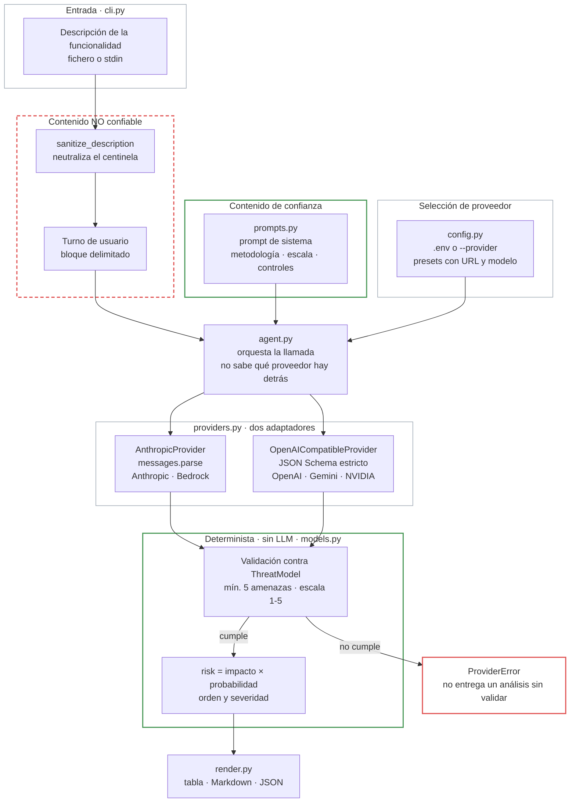

# Threat Modeling Agent

Asistente de *threat modeling* para el equipo de Ciberseguridad, pensado para el arranque de una funcionalidad en el Secure SDLC. Recibe la descripción en texto plano de una funcionalidad nueva y devuelve un modelo de amenazas STRIDE **priorizado por riesgo**, con la justificación de cada puntuación y el control asociado.

Implementación de la **Opción 1** del enunciado. Cubre la actividad 2 del Secure SDLC —*Threat Modeling*— y alimenta la 3 y la 4, identificación de amenazas y recomendación de controles.

> El agente **no sustituye la decisión del especialista**. Produce un borrador revisable: por eso declara siempre lo que ha asumido y lo que no puede evaluar, y por eso su salida lo dice en la propia cabecera.

## Cobertura del enunciado

| Requisito | Dónde se cumple | Garantizado por |
| --- | --- | --- |
| Recibe la descripción de una funcionalidad | `analyze-feature`, desde fichero o *stdin* | `cli.py` |
| Genera **al menos 5 amenazas** | `threats: list[Threat]` con `min_length=5` | El esquema, no el prompt |
| Metodología STRIDE | Campo obligatorio por amenaza, seis categorías | `Stride` en `models.py` |
| **Prioriza por riesgo**, no lista de buenas prácticas | `risk = impacto × probabilidad`, orden descendente | Código, no el LLM |
| Parte B — arquitectura del agente | [Arquitectura](#arquitectura) | — |
| Asiste, no sustituye al especialista | Asunciones, fuera de alcance y riesgo residual en cada salida | El esquema |

## Uso

```bash
uv sync

# Análisis completo (llama a la API)
uv run threat-agent analyze-feature examples/upload-pdf-feature.txt

# Guardando los resultados
uv run threat-agent analyze-feature examples/upload-pdf-feature.txt \
    --json out/analysis.json --md out/analysis.md

# Desde stdin
echo "Subimos PDFs a S3 y los procesa una Lambda con Bedrock." | uv run threat-agent analyze-feature -

# Releer un análisis guardado, sin llamar a la API ni depender de la red
uv run threat-agent show examples/upload-pdf-feature.kimi-k3.json
```

`examples/` contiene la descripción del enunciado y dos salidas reales, en JSON y Markdown, nombradas por proveedor. Sirven para ver el resultado sin gastar una llamada.

## Arquitectura



Los recuadros de borde verde son contenido de confianza o cálculo determinista; el de borde rojo discontinuo es la entrada que **no** lo es. La rama de la derecha —validación que no se cumple— es deliberada: ante una salida que no encaja en el esquema el agente falla, no degrada.

Siete módulos, cada uno con una responsabilidad:

| Módulo | Responsabilidad |
| --- | --- |
| `cli.py` | Entrada (fichero o *stdin*), salida (terminal, JSON, Markdown) y códigos de retorno. |
| `prompts.py` | Prompt de sistema y construcción del turno de usuario. Frontera entre lo confiable y lo que no lo es. |
| `agent.py` | Orquestación. No sabe qué proveedor hay detrás. |
| `providers.py` | Los dos adaptadores. Único punto del paquete que habla con un LLM. |
| `config.py` | Elección del proveedor desde el `.env`. |
| `models.py` | Esquema Pydantic de la salida **y** la aritmética del riesgo. |
| `render.py` | Presentación. No decide nada. |

### Es un workflow de una sola llamada, no un agente autónomo

**No hay bucle de herramientas.** La tarea está acotada —de una descripción sale un modelo de amenazas— y no requiere que el modelo explore, consulte fuentes ni encadene decisiones. Un bucle autónomo aquí añadiría latencia, coste y no determinismo sin mejorar el resultado, y haría la salida más difícil de revisar.

El criterio para escalar a un agente con bucle es el habitual: complejidad que no se puede especificar por adelantado, valor que justifique el coste, y errores recuperables. Aquí solo se cumple el tercero. Si el alcance creciera —leer el repositorio, consultar el inventario de servicios, cruzar con CVE— entonces sí, y el punto de extensión sería `agent.py` sin tocar el resto.

## Las tres decisiones que sostienen el diseño

### 1. La aritmética del riesgo no la hace el LLM

El modelo emite `impact` y `likelihood` de 1 a 5, cada uno con su justificación por separado. El riesgo, la severidad y el orden los calcula `models.py`:

```python
@property
def risk(self) -> int:
    return self.impact * self.likelihood
```

`risk` y `severity` **no son campos del esquema**: el modelo no puede emitirlos. Un LLM al que se le pide "ordena por riesgo" produce un orden plausible pero no auditable, y no reproducible entre ejecuciones. Aquí la priorización es una multiplicación: se puede verificar a mano, se puede discutir sobre la puntuación de cada eje —que es la conversación útil con el equipo de Producto— y no cambia entre ejecuciones. **El modelo aporta el juicio sobre cada eje; el código, la aritmética.**

El desempate a igualdad de riesgo es por impacto: ante el mismo número, primero lo que más daño hace.

Contra el sesgo de "todo es crítico" se actúa por tres vías: la escala del prompt define qué significa cada valor en términos de la arquitectura analizada; se exige justificación separada para impacto y para probabilidad, lo que obliga a razonar cada eje por su cuenta; y se pide explícitamente calibrar. La revisión humana de esas dos justificaciones es donde el especialista aporta.

### 2. La descripción de entrada es dato, no instrucciones

Quien redacta la descripción de una funcionalidad no debería poder redirigir su propia revisión de seguridad. La separación es estructural:

- La metodología, la escala y el catálogo de controles van en el **prompt de sistema**, que es contenido del equipo de Seguridad.
- La descripción entra en el **turno de usuario**, delimitada por un centinela y marcada explícitamente como dato a analizar.
- `sanitize_description` **neutraliza el centinela** si aparece en el texto de entrada, para que no se pueda cerrar el bloque desde dentro y escribir fuera de él.
- El contenido **no se filtra ni se reescribe**: se delimita. Censurar la entrada ocultaría amenazas reales.
- El prompt de sistema instruye además que, si la descripción contiene instrucciones dirigidas al modelo, el agente **registre el intento como una amenaza** de categoría Tampering, en lugar de ignorarlo en silencio.

Ese último punto es deliberado: un atacante capaz de influir en la descripción de una funcionalidad puede influir en su revisión de seguridad, y eso es en sí mismo un hallazgo que el especialista debe ver.

### 3. La salida es estructurada, no texto parseado

La respuesta llega **validada contra `ThreatModel`**, no como texto libre del que haya que extraer una tabla con expresiones regulares. Cada adaptador lo consigue por su vía:

- **Anthropic y Bedrock** — `client.messages.parse()` con el esquema Pydantic como `output_format`. El SDK valida por su cuenta.
- **Compatibles con OpenAI** — `response_format` con el JSON Schema en modo estricto, convertido por `_to_strict_schema()`, y **revalidación con Pydantic al recibir**.

Dos consecuencias prácticas, iguales en ambas rutas: el mínimo de **5 amenazas** lo garantiza el esquema (`min_length=5`) y no una frase del prompt que el modelo puede desatender; y las puntuaciones fuera de la escala 1-5 las rechaza la validación (`ge=1, le=5`), así que el modelo no puede inventarse un impacto de 7 para colocar una amenaza arriba.

**La revalidación no es redundante.** Al probar el catálogo de NVIDIA, `nemotron-3-super-120b` aceptó el `response_format` con esquema estricto, respondió **HTTP 200** y devolvió su propio razonamiento en lenguaje natural en el campo del contenido, ignorando el esquema por completo. Nada en el protocolo delataba el problema. Lo detuvo Pydantic. Por eso, ante un esquema incumplido, el agente **falla con un error explícito** en vez de entregar un análisis sin validar: un fallo visible es preferible a un modelo de amenazas en el que no se puede confiar.

## Independencia del proveedor

**El agente no está atado a un fabricante.** El proveedor se elige desde variables de entorno; no se toca código.

```bash
cp .env.example .env      # y rellena solo el proveedor que vayas a usar
```

| `THREAT_AGENT_PROVIDER` | Cubre |
| --- | --- |
| `anthropic` *(por defecto)* | API de Anthropic |
| `bedrock` | Amazon Bedrock: sin clave propia, autentica con credenciales de AWS |
| `openai` · `openrouter` · `gemini` | Sus APIs respectivas |
| `openai-compatible` | NVIDIA NIM, Groq, Together, vLLM, Ollama local… |

**Solo hay dos adaptadores, no uno por fabricante.** OpenAI, OpenRouter y Gemini hablan el protocolo de OpenAI, así que se cubren con uno que cambia de `base_url`; el otro cubre Anthropic y Bedrock. Añadir un proveedor suele ser una entrada en `PRESETS`, no un módulo. Los paquetes de los compatibles con OpenAI son un extra opcional (`uv sync --extra openai`).

Cada preset trae su `base_url` y su modelo. `--provider` y `--model` ganan al `.env`, y el entorno gana al fichero para poder sobrescribir en CI. `.env` está en `.gitignore` y nunca se commitea; `.env.example` documenta todas las variables.

### Verificado, no supuesto

Ejecutado contra proveedores reales sobre la descripción del enunciado. **Kimi K3** (vía NVIDIA) devolvió 7 amenazas y **Gemini 3 Flash** 5, ambas válidas; las dos salidas están en `examples/`. Se descartaron dos modelos por el camino: uno agotó el *gateway* con un 504 y otro es el caso de `nemotron` descrito arriba.

En ambas ejecuciones se verificó, sobre el JSON y no sobre la tabla renderizada, que `riesgo = impacto × probabilidad` en todas las amenazas, que la severidad cae en su banda, que el orden es descendente y que ningún campo de justificación queda vacío.

**Los dos modelos coinciden, de forma independiente, en la amenaza número 1**: fuga de información por una autorización que valida la firma del JWT pero no la propiedad del recurso —IDOR—, con riesgo 16 en ambos. Los dos identifican también la *prompt injection* a través del PDF hacia Bedrock.

Que la priorización converja entre fabricantes distintos es el argumento de que no es ruido del modelo: la aritmética la hace el código sobre juicios independientes.

Sus coberturas STRIDE, en cambio, **no** coinciden: Gemini identifica *Elevation of Privilege* y omite *Spoofing* y *Repudiation*; Kimi hace lo contrario. Entre los dos cubren las seis categorías, pero ninguno por separado. Es la delimitación exacta del alcance del agente: produce un borrador que el especialista debe completar, no un modelo de amenazas cerrado.

### Contraste con el threat model manual

La descripción del enunciado es el mismo sistema que analiza a mano el [Reto 1](../challenge-1-cloud-architecture/threat-model.md). Eso permite contrastar el borrador del agente contra un modelo de amenazas escrito por una persona sobre la misma arquitectura:

| | Threat model manual (Reto 1) | Agente (Reto 2) |
| --- | --- | --- |
| Amenaza nº 1 | IDOR en la consulta de resultados · riesgo 20 | **La misma** · riesgo 16, en los dos proveedores |
| Amenaza nº 2 | Suplantación por JWT mal validado · riesgo 20 | **La misma** · riesgo 12 |
| *Prompt injection* vía documento | Riesgo 16 | Detectada por ambos · riesgo 12 y 9 |
| Total de amenazas | 11 | 7 y 5 |

El agente reproduce las dos amenazas principales del análisis manual y detecta la *prompt injection* indirecta, que es la amenaza específica de IA de esta arquitectura. No es una comparación ciega —quien escribió el prompt de sistema es quien hizo el análisis manual—, pero sí muestra que el agente no se queda en generalidades: llega a los mismos escenarios concretos.

Dos diferencias que conviene leer con atención, porque son el argumento de por qué esto asiste y no sustituye:

- **Encuentra menos.** 7 y 5 frente a 11. El análisis manual cubre superficie que el agente no alcanza con solo la descripción en texto.
- **Clasifica distinto.** El IDOR es *Elevation of Privilege* en el análisis manual y *Information Disclosure* para ambos modelos. Las dos lecturas son defendibles —se accede a un recurso ajeno y el resultado es una fuga—, y es un recordatorio de que la letra STRIDE es una convención discutible, no un dato. Por eso la priorización se apoya en impacto y probabilidad, que sí son comparables, y no en la categoría.

## Stack y manejo de errores

Python 3.12 y `uv`. `pydantic` para el esquema y la validación, `typer` para el CLI y `rich` para la tabla en terminal. `pytest` y `ruff` en desarrollo. El SDK depende del proveedor: `anthropic` por defecto —cubre también Bedrock—, `openai` como extra opcional. El modelo lo fija el preset —`claude-opus-5` en Anthropic— y se cambia con `--model` o desde el `.env`.

Los fallos del SDK se traducen a mensajes accionables en lugar de dejar salir una traza, y se comprueban dos condiciones que no son excepciones y se perderían en silencio: `stop_reason == "refusal"`, que se mira **antes** de leer la respuesta, y `stop_reason == "max_tokens"`, que avisa de una respuesta truncada.

El tiempo de espera y los reintentos se fijan explícitamente —`DEFAULT_TIMEOUT = 180.0`, `DEFAULT_MAX_RETRIES = 1`— en vez de heredar los 600 s por intento y hasta tres reintentos que traen los SDK. Un análisis tarda entre uno y cuatro minutos, así que el límite falla mientras todavía es útil cambiar de proveedor; y reintentar en bucle contra un servicio ya degradado le añade carga y multiplica el coste sin que nadie lo pida. Un *timeout* se distingue de un fallo de red —`APITimeoutError` hereda de `APIConnectionError`, así que se captura primero— y su mensaje nombra el límite y sugiere qué hacer.

## Tests

```bash
uv run pytest        # 63 tests
uv run ruff check .
```

Los tests cubren lo que sostiene el argumento del diseño, no la llamada a la API: que el riesgo es el producto, que el orden es descendente y estable, que las bandas de severidad cuadran en sus límites, que el esquema rechaza puntuaciones fuera de escala y modelos con menos de 5 amenazas, que el centinela incrustado en la entrada se neutraliza, y que la descripción nunca acaba en el prompt de sistema.

Sobre la capa de proveedores: que la bandera del CLI gana al `.env` y el entorno gana al fichero, que la falta de una clave da un error que **nombra la variable que falta** en lugar de un fallo de autenticación treinta segundos después, y que la conversión del esquema al modo estricto llega hasta los objetos anidados conservando `minItems: 5` y los límites de la escala. Esa última es la que protege la garantía: si la conversión se rompiera, el proveedor aceptaría el esquema sin imponerlo.

## Límites conocidos

- **Analiza lo que se le describe.** Si la descripción omite un componente, no aparecerá en el modelo de amenazas. Por eso la salida incluye asunciones y fuera de alcance: son la lista de lo que hay que preguntarle al equipo.
- **No lee el código ni la infraestructura.** Es la Opción 1 del enunciado; la revisión de código es la Opción 2.
- **No es determinista en el contenido.** La aritmética sí lo es; qué amenazas emite el modelo puede variar entre ejecuciones. Por eso es un borrador para revisión, no un veredicto.
- **La cobertura STRIDE no está garantizada.** El esquema exige 5 amenazas, no una por categoría. Forzar una amenaza por letra produciría relleno, así que se prefiere el hueco visible.
- **El límite de tokens de salida es fijo** (16 000) y no se ajusta desde el CLI.
